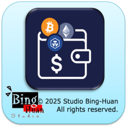
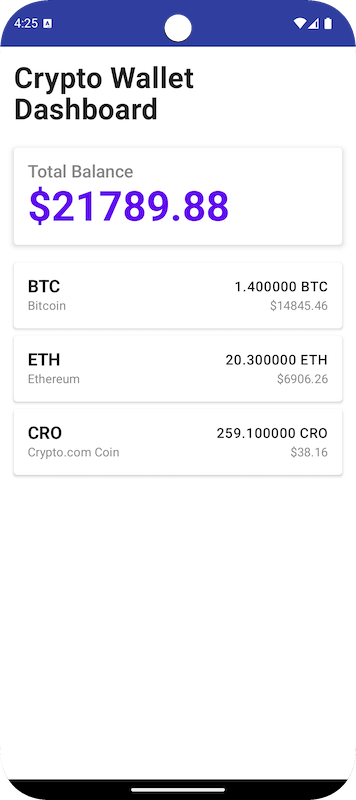

# Wallet Dashboard Android App

A modern Android application that displays cryptocurrency wallet balances with real-time USD conversions for BTC, ETH, and CRO currencies.



- [Wallet Dashboard Android App](#wallet-dashboard-android-app)
  - [Quick Start](#quick-start)
  - [Features](#features)
  - [Architecture](#architecture)
    - [Architecture Components](#architecture-components)
    - [Tech Stack](#tech-stack)
  - [Project Structure](#project-structure)
  - [Data Source](#data-source)
  - [Key Features Implementation](#key-features-implementation)
    - [Modular UI Components](#modular-ui-components)
    - [Reactive Data Flow](#reactive-data-flow)
    - [USD Conversion Calculation](#usd-conversion-calculation)
    - [Modern UI with Compose](#modern-ui-with-compose)
  - [Building and Running](#building-and-running)
    - [Prerequisites](#prerequisites)
    - [Build Instructions](#build-instructions)
    - [Command Line Build](#command-line-build)
    - [Running Tests](#running-tests)
  - [Testing](#testing)
    - [Test Coverage](#test-coverage)
    - [Running Specific Tests](#running-specific-tests)
  - [Development Features](#development-features)
    - [Compose Previews](#compose-previews)
    - [Code Quality](#code-quality)
  - [Future Enhancements](#future-enhancements)
  - [Performance Considerations](#performance-considerations)
  - [Requirements Compliance](#requirements-compliance)
  - [Dependencies](#dependencies)
  - [Technical Highlights](#technical-highlights)
    - [Kotlin Coroutines \& Flow](#kotlin-coroutines--flow)
    - [Jetpack Compose UI](#jetpack-compose-ui)
    - [Hilt Dependency Injection](#hilt-dependency-injection)
  - [License](#license)


## Quick Start

```bash
# Clone and build
git clone <repository-url>
cd WalletDashboard
./gradlew assembleDebug

# Or open in Android Studio and run
```

## Features

- **Portfolio Overview**: Display total portfolio value in USD
- **Multi-Currency Support**: Support for Bitcoin (BTC), Ethereum (ETH), and Crypto.com Coin (CRO)
- **Real-time Conversion**: Live exchange rates to USD
- **Modern UI**: Clean, intuitive interface built with Jetpack Compose
- **Modular Components**: Reusable UI components with comprehensive Preview support
- **Reactive Programming**: Uses Kotlin Coroutines and Flow for reactive data updates
- **Architecture**: MVVM pattern with Repository pattern for data management
- **Error Handling**: Comprehensive error states with retry functionality
- **Loading States**: Smooth loading indicators and state management

## Architecture

This app follows Android development best practices:

### Architecture Components
- **MVVM (Model-View-ViewModel)**: Clear separation of concerns
- **Repository Pattern**: Centralized data access layer
- **Dependency Injection**: Using Hilt for dependency management
- **Reactive Programming**: Kotlin Coroutines and Flow for asynchronous operations

### Tech Stack
- **Language**: Kotlin 2.1.0
- **UI Framework**: Jetpack Compose with Material Design 3
- **Architecture**: MVVM with Repository pattern
- **Dependency Injection**: Hilt
- **Serialization**: Kotlinx Serialization
- **Testing**: JUnit, Mockito, Turbine for Flow testing
- **Reactive Programming**: Kotlin Coroutines and Flow
- **Build System**: Gradle with Kotlin DSL
- **Symbol Processing**: KSP (Kotlin Symbol Processing)
- **Minimum SDK**: API 24 (Android 7.0)
- **Target SDK**: API 34 (Android 14)

## Project Structure

```
app/src/main/kotlin/com/cryptodotcom/walletdashboard/
├── data/
│   ├── datasource/
│   │   └── LocalDataSource.kt          # Main local JSON data source
│   ├── model/
│   │   ├── Currency.kt                 # Currency data model
│   │   ├── ExchangeRate.kt            # Exchange rate data model
│   │   ├── WalletBalance.kt           # Wallet balance data model
│   │   └── WalletItem.kt              # Combined wallet item model
│   └── repository/
│       └── WalletRepository.kt         # Data repository with DI
├── di/
│   └── AppModule.kt                   # Hilt dependency injection module
├── presentation/
│   ├── ui/
│   │   ├── WalletDashboardScreen.kt   # Main UI screen
│   │   ├── components/
│   │   │   ├── TotalBalanceCard.kt    # Total balance card component
│   │   │   └── WalletItemCard.kt      # Wallet item card component
│   │   └── theme/                     # App theme and styling
│   │       ├── Color.kt
│   │       ├── Theme.kt
│   │       └── Type.kt
│   └── viewmodel/
│       └── WalletViewModel.kt         # ViewModel for UI state management
├── MainActivity.kt                    # Main activity
└── WalletDashboardApplication.kt      # Application class with Hilt

app/src/test/kotlin/com/cryptodotcom/walletdashboard/
├── WalletRepositoryTest.kt            # Repository unit tests
└── WalletViewModelTest.kt             # ViewModel unit tests
```

## Data Source

The app uses three JSON data sources as specified in the requirements:

1. **Supported Currencies**: Information about BTC, ETH, and CRO
2. **Exchange Rates**: Live rates from each currency to USD
3. **Wallet Balances**: Current balance for each supported currency

## Key Features Implementation

### Modular UI Components
- **TotalBalanceCard**: Reusable component for displaying total portfolio value
- **WalletItemCard**: Individual cryptocurrency card with balance and USD value
- **Comprehensive Previews**: Multiple Preview functions for each component
- **Material Design 3**: Consistent Material Design 3 system throughout

### Reactive Data Flow
- Uses Kotlin Flow to combine data from multiple sources
- Reactive UI updates when data changes
- Proper error handling and loading states
- Clean separation between data layer and UI layer

### USD Conversion Calculation
```kotlin
usdValue = balance * exchangeRate
```

For example: If user has 1.4 BTC and the exchange rate is 10603.9, then:
USD Value = 1.4 * 10603.9 = 14845.46 USD

### Modern UI with Compose
- Material Design 3 system with consistent theming
- Responsive layout with proper spacing
- Loading and error states with retry functionality
- Clean card-based design for wallet items
- Smooth animations and transitions

## Building and Running

### Prerequisites
- Android Studio Hedgehog or later
- JDK 17 or later
- Android SDK API 34

### Build Instructions

1. Clone the repository:
   ```bash
   git clone <repository-url>
   cd WalletDashboard
   ```

2. Open the project in Android Studio:
   - Open Android Studio
   - Select "Open an existing project"
   - Navigate to the WalletDashboard folder

3. Wait for Gradle sync to complete

4. Run the app:
   - Select a device or emulator
   - Click the "Run" button or press `Ctrl+R` (Windows/Linux) or `Cmd+R` (Mac)

### Command Line Build
```bash
# Debug build
./gradlew assembleDebug

# Release build
./gradlew assembleRelease

# Install debug APK
./gradlew installDebug
```

### Running Tests
```bash
# Run all unit tests
./gradlew test

# Run specific test
./gradlew test --tests="WalletRepositoryTest"

# Run tests with coverage
./gradlew testDebugUnitTestCoverage
```

## Testing

The app includes comprehensive unit tests with high coverage:

### Test Coverage
- **Repository Tests**: 
  - Data combination from multiple sources
  - USD conversion calculations
  - Error handling scenarios
  - Flow emission testing
  
- **ViewModel Tests**: 
  - UI state management
  - Reactive flow behavior
  - Loading and error states
  - Retry functionality

- **Testing Tools**:
  - **JUnit 4**: Testing framework
  - **Mockito**: Mocking dependencies
  - **Turbine**: Testing Kotlin Flow emissions
  - **Coroutines Test**: Testing coroutine behavior

### Running Specific Tests
```bash
# Repository tests
./gradlew test --tests="WalletRepositoryTest"

# ViewModel tests  
./gradlew test --tests="WalletViewModelTest"

# All tests with detailed output
./gradlew test --info
```

## Development Features

### Compose Previews
The app includes extensive Preview support for rapid UI development:

- **TotalBalanceCard Previews**:
  - Standard value preview ($25,700.00)
  - Small value preview ($123.45)  
  - Zero value preview ($0.00)

- **WalletItemCard Previews**:
  - Bitcoin (BTC) preview
  - Ethereum (ETH) preview
  - Tether (USDT) preview

- **Screen Previews**:
  - Complete WalletDashboardScreen preview
  - Individual component previews

### Code Quality
- **Clean Architecture**: Clear separation of concerns
- **SOLID Principles**: Following SOLID design principles
- **Dependency Injection**: Proper DI setup with Hilt
- **Error Handling**: Comprehensive error scenarios
- **Type Safety**: Leveraging Kotlin's type system
- **Code Documentation**: Well-documented code with clear naming

## Future Enhancements

The architecture supports easy addition of:

- **Remote API Integration**: Replace LocalDataSource with network calls (Retrofit/Ktor)
- **Database Caching**: Add Room database for offline support and data persistence
- **More Currencies**: Easily extendable to support additional cryptocurrencies
- **Real-time Updates**: WebSocket integration for live price updates
- **User Authentication**: Add user accounts and personalized portfolios
- **Transaction History**: Display transaction history and analytics
- **Price Charts**: Add interactive price charts and historical data
- **Dark Theme**: Implement dark/light theme switching
- **Localization**: Multi-language support
- **Widget Support**: Home screen widget for quick portfolio overview
- **Biometric Security**: Fingerprint/Face ID for app access
- **Push Notifications**: Price alerts and portfolio updates

## Performance Considerations

- **Lazy Loading**: LazyColumn for efficient list rendering
- **State Management**: Proper state hoisting and minimal recomposition
- **Memory Management**: Efficient data structures and resource cleanup
- **Coroutine Scope**: Proper coroutine lifecycle management
- **Preview Optimization**: Separate preview functions for faster development

## Requirements Compliance

✅ **Kotlin**: Entire app written in Kotlin 2.1.0  
✅ **Compile and Run**: Project builds and runs successfully on Android SDK 34  
✅ **Reactive Programming**: Uses Kotlin Coroutines and Flow throughout the app  
✅ **Git Repository**: Committed to private GitHub repository with clean history  
✅ **Architecture**: Clean, well-structured MVVM architecture with DI  
✅ **Error Handling**: Proper error scenarios and edge cases handled  
✅ **Future-Ready**: Modular architecture supports future feature additions  
✅ **Modern UI**: Jetpack Compose with Material Design 3  
✅ **Testing**: Comprehensive unit tests with Flow testing  
✅ **Code Quality**: Clean code with proper separation of concerns  

## Dependencies

Key dependencies used in the project:

```kotlin
// UI
implementation("androidx.compose.ui:ui:1.8.3")
implementation("androidx.compose.material:material:1.8.3")
implementation("androidx.activity:activity-compose:1.10.1")

// Architecture
implementation("androidx.lifecycle:lifecycle-viewmodel-compose:2.9.2")
implementation("androidx.hilt:hilt-navigation-compose:1.2.0")

// Dependency Injection
implementation("com.google.dagger:hilt-android:2.51.1")
ksp("com.google.dagger:hilt-android-compiler:2.51.1")

// Coroutines
implementation("org.jetbrains.kotlinx:kotlinx-coroutines-android:1.10.2")

// Serialization
implementation("org.jetbrains.kotlinx:kotlinx-serialization-json:1.9.0")

// Testing
testImplementation("junit:junit:4.13.2")
testImplementation("org.mockito:mockito-core:5.18.0")
testImplementation("app.cash.turbine:turbine:1.2.1")
testImplementation("org.jetbrains.kotlinx:kotlinx-coroutines-test:1.10.2")
```

## Technical Highlights

### Kotlin Coroutines & Flow
```kotlin
// Reactive data combination
fun getWalletItems(): Flow<List<WalletItem>> {
    return combine(
        localDataSource.getCurrencies(),
        localDataSource.getExchangeRates(),
        localDataSource.getWalletBalance()
    ) { currencies, exchanges, balances ->
        // Combine and transform data
    }
}
```

### Jetpack Compose UI
```kotlin
@Composable
fun TotalBalanceCard(totalUsdValue: Double) {
    Card(elevation = 4.dp) {
        Text(
            text = "$${String.format("%.2f", totalUsdValue)}",
            style = MaterialTheme.typography.h3
        )
    }
}
```

### Hilt Dependency Injection
```kotlin
@HiltViewModel
class WalletViewModel @Inject constructor(
    private val repository: WalletRepository
) : ViewModel()
```

## License

This project is created as a coding test for Crypto.com Android developer position.

---