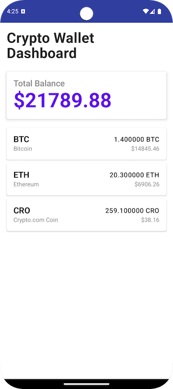

# 錢包儀表板 Android 應用程式

一個現代化的 Android 應用程式，支援顯示 BTC、ETH 和 CRO 加密貨幣錢包餘額，並提供即時美元匯率轉換功能。



- [錢包儀表板 Android 應用程式](#錢包儀表板-android-應用程式)
  - [快速開始](#快速開始)
  - [功能特色](#功能特色)
  - [架構設計](#架構設計)
    - [架構組件](#架構組件)
    - [技術棧](#技術棧)
  - [專案結構](#專案結構)
  - [資料來源](#資料來源)
  - [核心功能實作](#核心功能實作)
    - [模組化 UI 組件](#模組化-ui-組件)
    - [響應式資料流](#響應式資料流)
    - [美元轉換計算](#美元轉換計算)
    - [Compose 現代化 UI](#compose-現代化-ui)
  - [建置與運行](#建置與運行)
    - [先決條件](#先決條件)
    - [建置說明](#建置說明)
    - [命令列建置](#命令列建置)
    - [執行測試](#執行測試)
  - [測試](#測試)
    - [測試覆蓋率](#測試覆蓋率)
    - [執行特定測試](#執行特定測試)
  - [開發功能](#開發功能)
    - [Compose 預覽](#compose-預覽)
    - [程式碼品質](#程式碼品質)
  - [未來增強功能](#未來增強功能)
  - [效能考量](#效能考量)
  - [需求符合性](#需求符合性)
  - [相依套件](#相依套件)
  - [技術亮點](#技術亮點)
    - [Kotlin 協程與 Flow](#kotlin-協程與-flow)
    - [Jetpack Compose UI](#jetpack-compose-ui)
    - [Hilt 依賴注入](#hilt-依賴注入)
  - [授權條款](#授權條款)


## 快速開始

```bash
# 複製並建置
git clone <repository-url>
cd WalletDashboard
./gradlew assembleDebug

# 或使用 Android Studio 開啟並執行
```

## 功能特色

- **投資組合總覽**：顯示投資組合的美元總價值
- **多幣種支援**：支援比特幣 (BTC)、以太坊 (ETH) 和 Crypto.com 幣 (CRO)
- **即時匯率轉換**：提供即時美元匯率
- **現代化 UI**：使用 Jetpack Compose 建構的簡潔直觀介面
- **模組化組件**：可重複使用的 UI 組件，具備完整的預覽支援
- **響應式程式設計**：使用 Kotlin 協程和 Flow 實現響應式資料更新
- **架構設計**：採用 MVVM 模式和 Repository 模式進行資料管理
- **錯誤處理**：完整的錯誤狀態和重試功能
- **載入狀態**：流暢的載入指示器和狀態管理

## 架構設計

本應用程式遵循 Android 開發最佳實務：

### 架構組件
- **MVVM (Model-View-ViewModel)**：清楚的關注點分離
- **Repository 模式**：集中式資料存取層
- **依賴注入**：使用 Hilt 進行依賴管理
- **響應式程式設計**：使用 Kotlin 協程和 Flow 處理非同步操作

### 技術棧
- **程式語言**：Kotlin 2.1.0
- **UI 框架**：Jetpack Compose 搭配 Material Design 3
- **架構**：MVVM 搭配 Repository 模式
- **依賴注入**：Hilt
- **序列化**：Kotlinx Serialization
- **測試**：JUnit、Mockito、Turbine 用於 Flow 測試
- **響應式程式設計**：Kotlin 協程和 Flow
- **建置系統**：Gradle 搭配 Kotlin DSL
- **符號處理**：KSP (Kotlin Symbol Processing)
- **最低 SDK**：API 24 (Android 7.0)
- **目標 SDK**：API 34 (Android 14)

## 專案結構

```
app/src/main/kotlin/com/cryptodotcom/walletdashboard/
├── data/
│   ├── datasource/
│   │   └── LocalDataSource.kt          # 主要本地 JSON 資料來源
│   ├── model/
│   │   ├── Currency.kt                 # 貨幣資料模型
│   │   ├── ExchangeRate.kt            # 匯率資料模型
│   │   ├── WalletBalance.kt           # 錢包餘額資料模型
│   │   └── WalletItem.kt              # 組合錢包項目模型
│   └── repository/
│       └── WalletRepository.kt         # 資料儲存庫與 DI
├── di/
│   └── AppModule.kt                   # Hilt 依賴注入模組
├── presentation/
│   ├── ui/
│   │   ├── WalletDashboardScreen.kt   # 主要 UI 畫面
│   │   ├── components/
│   │   │   ├── TotalBalanceCard.kt    # 總餘額卡片組件
│   │   │   └── WalletItemCard.kt      # 錢包項目卡片組件
│   │   └── theme/                     # 應用程式主題與樣式
│   │       ├── Color.kt
│   │       ├── Theme.kt
│   │       └── Type.kt
│   └── viewmodel/
│       └── WalletViewModel.kt         # ViewModel 用於 UI 狀態管理
├── MainActivity.kt                    # 主要活動
└── WalletDashboardApplication.kt      # 應用程式類別與 Hilt

app/src/test/kotlin/com/cryptodotcom/walletdashboard/
├── WalletRepositoryTest.kt            # Repository 單元測試
└── WalletViewModelTest.kt             # ViewModel 單元測試
```

## 資料來源

應用程式使用三個 JSON 資料來源，符合需求規格：

1. **支援的貨幣**：BTC、ETH 和 CRO 的相關資訊
2. **匯率資料**：各貨幣對美元的即時匯率
3. **錢包餘額**：每種支援貨幣的當前餘額

## 核心功能實作

### 模組化 UI 組件
- **TotalBalanceCard**：顯示投資組合總價值的可重複使用組件
- **WalletItemCard**：個別加密貨幣卡片，包含餘額和美元價值
- **完整預覽**：每個組件都有多個預覽功能
- **Material Design 3**：整體一致的 Material Design 3 系統

### 響應式資料流
- 使用 Kotlin Flow 結合多個資料來源
- 當資料變更時進行響應式 UI 更新
- 適當的錯誤處理和載入狀態
- 資料層和 UI 層之間的清楚分離

### 美元轉換計算
```kotlin
美元價值 = 餘額 * 匯率
```

例如：如果用戶持有 1.4 BTC，匯率為 10603.9，則：
美元價值 = 1.4 * 10603.9 = 14845.46 美元

### Compose 現代化 UI
- Material Design 3 系統與一致的主題
- 響應式佈局與適當的間距
- 載入和錯誤狀態與重試功能
- 簡潔的卡片式錢包項目設計
- 流暢的動畫和轉場效果

## 建置與運行

### 先決條件
- Android Studio Hedgehog 或更新版本
- JDK 17 或更新版本
- Android SDK API 34

### 建置說明

1. 複製儲存庫：
   ```bash
   git clone <repository-url>
   cd WalletDashboard
   ```

2. 在 Android Studio 中開啟專案：
   - 開啟 Android Studio
   - 選擇「開啟現有專案」
   - 導航至 WalletDashboard 資料夾

3. 等待 Gradle 同步完成

4. 執行應用程式：
   - 選擇裝置或模擬器
   - 點擊「執行」按鈕或按 `Ctrl+R` (Windows/Linux) 或 `Cmd+R` (Mac)

### 命令列建置
```bash
# Debug 建置
./gradlew assembleDebug

# Release 建置
./gradlew assembleRelease

# 安裝 debug APK
./gradlew installDebug
```

### 執行測試
```bash
# 執行所有單元測試
./gradlew test

# 執行特定測試
./gradlew test --tests="WalletRepositoryTest"

# 執行帶覆蓋率的測試
./gradlew testDebugUnitTestCoverage
```

## 測試

應用程式包含高覆蓋率的完整單元測試：

### 測試覆蓋率
- **Repository 測試**： 
  - 多個資料來源的資料結合
  - 美元轉換計算
  - 錯誤處理情境
  - Flow 發射測試
  
- **ViewModel 測試**： 
  - UI 狀態管理
  - 響應式 flow 行為
  - 載入和錯誤狀態
  - 重試功能

- **測試工具**：
  - **JUnit 4**：測試框架
  - **Mockito**：模擬依賴
  - **Turbine**：測試 Kotlin Flow 發射
  - **Coroutines Test**：測試協程行為

### 執行特定測試
```bash
# Repository 測試
./gradlew test --tests="WalletRepositoryTest"

# ViewModel 測試  
./gradlew test --tests="WalletViewModelTest"

# 所有測試與詳細輸出
./gradlew test --info
```

## 開發功能

### Compose 預覽
應用程式包含廣泛的預覽支援，用於快速 UI 開發：

- **TotalBalanceCard 預覽**：
  - 標準值預覽 ($25,700.00)
  - 小值預覽 ($123.45)  
  - 零值預覽 ($0.00)

- **WalletItemCard 預覽**：
  - 比特幣 (BTC) 預覽
  - 以太坊 (ETH) 預覽
  - 泰達幣 (USDT) 預覽

- **畫面預覽**：
  - 完整的 WalletDashboardScreen 預覽
  - 個別組件預覽

### 程式碼品質
- **乾淨架構**：清楚的關注點分離
- **SOLID 原則**：遵循 SOLID 設計原則
- **依賴注入**：使用 Hilt 進行適當的 DI 設置
- **錯誤處理**：完整的錯誤情境處理
- **型別安全**：充分運用 Kotlin 的型別系統
- **程式碼文件**：詳細的程式碼文件與清楚的命名

## 未來增強功能

架構支援輕鬆添加以下功能：

- **遠端 API 整合**：使用網路呼叫 (Retrofit/Ktor) 取代 LocalDataSource
- **資料庫快取**：添加 Room 資料庫以支援離線和資料持久化
- **更多貨幣**：輕鬆擴展以支援額外的加密貨幣
- **即時更新**：WebSocket 整合以實現即時價格更新
- **用戶認證**：添加用戶帳戶和個人化投資組合
- **交易歷史**：顯示交易歷史和分析
- **價格圖表**：添加互動式價格圖表和歷史資料
- **深色主題**：實作深色/淺色主題切換
- **本地化**：多語言支援
- **小工具支援**：主畫面小工具用於快速投資組合概覽
- **生物識別安全**：指紋/Face ID 用於應用程式存取
- **推播通知**：價格警報和投資組合更新

## 效能考量

- **延遲載入**：LazyColumn 用於高效列表渲染
- **狀態管理**：適當的狀態提升和最小重組
- **記憶體管理**：高效的資料結構和資源清理
- **協程範圍**：適當的協程生命週期管理
- **預覽最佳化**：分離的預覽函數以加快開發速度

## 需求符合性

✅ **Kotlin**：整個應用程式使用 Kotlin 2.1.0 編寫  
✅ **編譯與執行**：專案在 Android SDK 34 上成功建置和執行  
✅ **響應式程式設計**：在整個應用程式中使用 Kotlin 協程和 Flow  
✅ **Git 儲存庫**：提交到私人 GitHub 儲存庫，具有乾淨的歷史記錄  
✅ **架構**：乾淨、結構良好的 MVVM 架構與 DI  
✅ **錯誤處理**：適當處理錯誤情境和邊界情況  
✅ **面向未來**：模組化架構支援未來功能添加  
✅ **現代化 UI**：Jetpack Compose 搭配 Material Design 3  
✅ **測試**：完整的單元測試與 Flow 測試  
✅ **程式碼品質**：乾淨的程式碼與適當的關注點分離  

## 相依套件

專案中使用的主要相依套件：

```kotlin
// UI
implementation("androidx.compose.ui:ui:1.8.3")
implementation("androidx.compose.material:material:1.8.3")
implementation("androidx.activity:activity-compose:1.10.1")

// 架構
implementation("androidx.lifecycle:lifecycle-viewmodel-compose:2.9.2")
implementation("androidx.hilt:hilt-navigation-compose:1.2.0")

// 依賴注入
implementation("com.google.dagger:hilt-android:2.51.1")
ksp("com.google.dagger:hilt-android-compiler:2.51.1")

// 協程
implementation("org.jetbrains.kotlinx:kotlinx-coroutines-android:1.10.2")

// 序列化
implementation("org.jetbrains.kotlinx:kotlinx-serialization-json:1.9.0")

// 測試
testImplementation("junit:junit:4.13.2")
testImplementation("org.mockito:mockito-core:5.18.0")
testImplementation("app.cash.turbine:turbine:1.2.1")
testImplementation("org.jetbrains.kotlinx:kotlinx-coroutines-test:1.10.2")
```

## 技術亮點

### Kotlin 協程與 Flow
```kotlin
// 響應式資料結合
fun getWalletItems(): Flow<List<WalletItem>> {
    return combine(
        localDataSource.getCurrencies(),
        localDataSource.getExchangeRates(),
        localDataSource.getWalletBalance()
    ) { currencies, exchanges, balances ->
        // 結合和轉換資料
    }
}
```

### Jetpack Compose UI
```kotlin
@Composable
fun TotalBalanceCard(totalUsdValue: Double) {
    Card(elevation = 4.dp) {
        Text(
            text = "$${String.format("%.2f", totalUsdValue)}",
            style = MaterialTheme.typography.h3
        )
    }
}
```

### Hilt 依賴注入
```kotlin
@HiltViewModel
class WalletViewModel @Inject constructor(
    private val repository: WalletRepository
) : ViewModel()
```

## 授權條款

此專案是為 Crypto.com Android 開發者職位的程式設計測試而建立。

---
